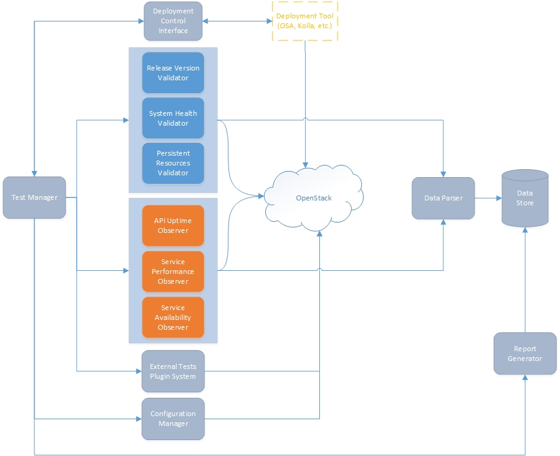

===========
Description
===========

Toolset for testing an OpenStack environment before, during, and after an upgrade process. The toolset answers the question "how does OpenStack behave across upgrades from release N to release N+1, or from the latest official release to master?". It also provides information that can be used to assess if an upgrade complies with the requirements for being recognized as a `rolling upgrade`_, a `zero downtime upgrade`_ or a `zero impact upgrade`_.

|

============
Requirements
============

**Functional**

1. The tool *must* be agnostic to the OpenStack environment and to the deployment tool used, performing actions consistently across different environments
2. It *must* validate that services are actually at the correct release version at any given time
3. It *must* validate that all services are functional at any given time (e.g. before, during and after an upgrade)
4. It *must* provide a way of creating and validating persistent resources, like VMs or volumes, at any given time
5. It *must* be capable of measuring if there is API downtime during a specified period of time for any of the `supported services`_ listed below
6. It *must* be capable to detect if all of the `supported services`_ listed below are fully available continuously during a specified period of time
7. It *must* have a centralized store for logs of tests and data collected
8. It *must* attempt to clean up after itself, if resources were created for testing or monitoring purposes they must be removed after they are no longer needed
9. It *must* be pluggable in services meaning that when new services are ready to implement an upgrade strategy (for example zero downtime or zero impact), they can be easily added to the scope of the tool
10. It *must* provide a common public interface that others can use to consume the toolset
11. It *must* provide a common public interface that the toolset can use to communicate with  deployment tools so certain steps of the deployment or the upgrade can be triggered
12. In case of cascade errors the tool *must* stop actions like creating resources that would lead to an even more unstable environment, attempt to clean up and report back
13. It *must* run tests using non-admin OpenStack user(s)
14. It *should* be capable of measuring the performance of the `supported services`_ listed below during a specified period of time
15. It *should* auto discover cloud services and configure the tool accordingly
16. It *should* verify that all requests made during an upgrade are honored at some point successfully, validating that they are not just added to a queue but are actually processed
17. It *should* provide the capability to add tests via a plugin system
18. It *should* use existing test discovery and plugin mechanisms to allow maximum reuse of test resources from existing OpenStack test tools
19. It *should* be capable of performing tests on one of the `supported services`_ at a time
20. It *could* include a GUI where results can be easily interpreted and *could* include trends
21. It *could* be capable of verifying if the data plane is accessible during a specified period of time

**Non-Functional**

21. *Must* be python 3 compatible
22. *Must* be compatible with Linux environments
23. *Should* be an official OpenStack project

Supported Services
==================

- Identity (Keystone)
- Compute (Nova)
- Object Storage (Swift)
- Block Storage (Cinder)
- Image (Glance)
- Networking (Neutron) *When available*

=====================
Requirements priority
=====================

Must have
  Requirements labeled as Must have are critical to the current delivery timebox in order for it to be a success. If even one Must have 
  requirement is not included, the project delivery should be considered a failure (note: requirements can be downgraded from Must have,
  by agreement with all relevant stakeholders; for example, when new requirements are deemed more important).

Should have
  Requirements labeled as Should have are important but not necessary for delivery in the current delivery timebox. While 'Should have' 
  requirements can be as important as 'Must have', they are often not as time-critical or there may be another way to satisfy the
  requirement, so that it can be held back until a future delivery timebox.

Could have
  Requirements labeled as Could have are desirable but not necessary, and could improve user experience or customer satisfaction for
  little development cost. These will typically be included if time and resources permit.

Won't have
  Requirements labeled as Won't have have been agreed by stakeholders as the least-critical, lowest-payback items, or not appropriate
  at that time. As a result, 'Won't have' requirements are not planned into the schedule for the delivery timebox. 'Won't have' 
  requirements are either dropped or reconsidered for inclusion in later timeboxes.

|

============
Main modules
============

- Data store
- Test manager
- Release version validator (Note: this could also be an observer)
- System health validator
- Persistent resources validator
- API uptime observer
- Service availability observer
- Service performance observer
- External tests plugin system* (Lower priority)
- Deployment control interface
- Report generator
- Data parser
- Configuration manager

|

=======
Diagram
=======

The following image shows a simplified diagram of the architecture of the toolset, it does not include all of the interactions between modules.

.. _rolling upgrade: https://governance.openstack.org/tc/reference/tags/assert_supports-rolling-upgrade.html
.. _zero downtime upgrade: https://governance.openstack.org/tc/reference/tags/assert_supports-zero-downtime-upgrade.html
.. _zero impact upgrade: https://governance.openstack.org/tc/reference/tags/assert_supports-zero-impact-upgrade.html
